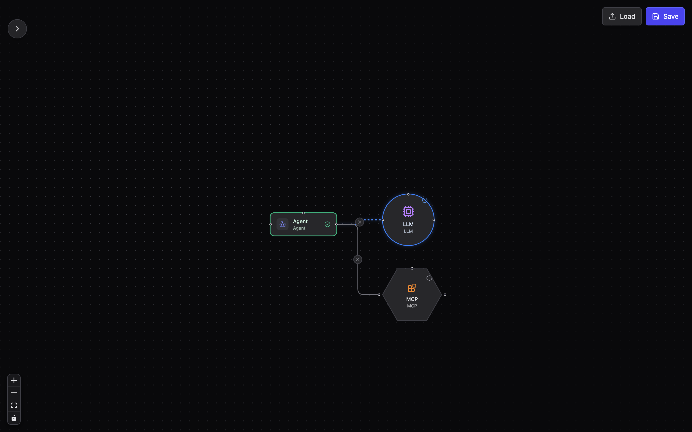

# Agent Flow Studio

**Agent Flow Studio** is a visual diagramming tool built on React Flow, developed for mapping LLM applications, agent architectures, and complex logic workflows.

No backend or database required start planning your architecture directly in the browser.

### Key Features

*   **Custom Nodes**: Built-in specialized nodes for LLM workflows, including Agent, LLM, Tool, RAG, MCP, and Conditions.
*   **Interactive Canvas**: Fluid drag and drop, context menus, and node management (copy/delete).
*   **Property Panel**: Edit node parameters like System Prompts, names, and status (Pending/Running/Completed) in real-time.
*   **Local Persistence**: Export and import workflows as `.json` files. 100% offline with full data privacy.
*   **Modern UI**: Built with Tailwind CSS, featuring a dark mode interface for focused editing.

## Preview



## Quick Start

Ensure you have [Node.js](https://nodejs.org/) installed, then follow these steps:

```bash
# 1. Clone the repository
git clone https://github.com/yourusername/agent-flow-studio.git

# 2. Enter the directory
cd agent-flow-studio

# 3. Install dependencies
npm install

# 4. Start local development server
npm run dev
```

---

*Effective system design through visual planning.*
