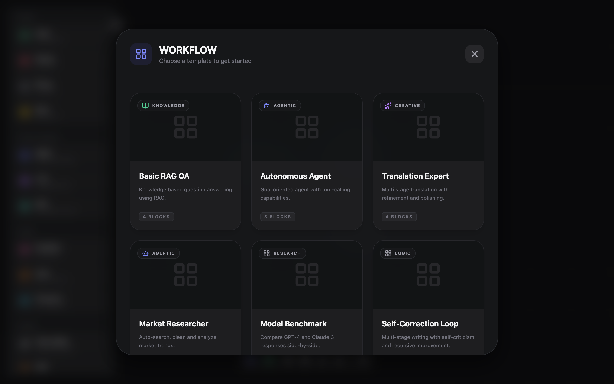

# Agent Flow Studio

**Agent Flow Studio** is a visual diagramming tool built on React Flow, developed for mapping LLM applications, agent architectures, and complex logic workflows.

No backend or database required start planning your architecture directly in the browser with a **Security First** approach.

## Key Features

*   **Visual Workflow Designer**: Fluid drag-and-drop interface for building complex AI logic.
*   **AI-First Components**: Specialized nodes for Agents, LLMs (OpenAI/Gemini), RAG, and more.
*   **Multi-Provider Support**: Seamlessly switch between Gemini and OpenAI for your simulations.
*   **Global Settings**: Toggle Grid, Snap to Grid, and manage API keys in one unified panel.
*   **Local Persistence**: Export and import workflows as `.json` files. 100% data ownership.

## Security & Privacy (Local-First)

Agent Flow Studio is designed around user privacy and data security. Unlike other cloud-based tools, we prioritize a **Local-First** philosophy:

- **Browser-Only Storage**: All configuration, including your **Gemini and OpenAI API Keys**, is stored exclusively in your current browser's `localStorage`.
- **Zero Server Overhead**: The application is a static client-side tool. Your sensitive keys and workflow data are **never** transmitted to any third-party server other than the official AI model providers.
- **Direct Communication**: Execution requests are sent directly from your browser to the AI service (Google/OpenAI).
- **Transparent Management**: You can reset, clear, or update your local configuration at any time via the "Settings" panel in the sidebar.

### User Interface


### Template


## Quick Start

Ensure you have [Node.js](https://nodejs.org/) installed, then follow these steps:

```bash
# 1. Clone the repository
git clone https://github.com/yourusername/agent-flow-studio.git

# 2. Enter the directory
cd agent-flow-studio

# 3. Install dependencies
npm install

# 4. Start local development server
npm run dev
```

---

*Effective system design through visual planning.*
